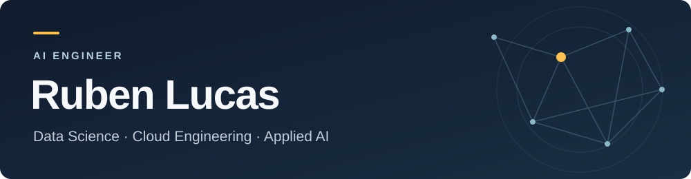

  

  <a href="https://www.linkedin.com/in/ruben-h-lucas/">LinkedIn</a> &nbsp;·&nbsp;
  <a href="https://github.com/Rubinjo?tab=repositories">Projects</a>

## Hi, I'm Ruben 👋

**AI Engineer with a background in Data Science and Cloud Engineering.**

I have 4+ years of experience designing, developing, and deploying production AI and data-driven solutions across enterprise environments. I turn complex business requirements into reliable technical solutions, working across the full lifecycle. Data ingestion, model and application development, deployment, CI/CD, and platform operations.

My experience includes **AI systems deployed at scale across 100+ Dutch municipalities**, as well as machine learning research and industrial mobile and web applications.

Based in the Netherlands.

## What I work on

- **Applied AI:** machine learning, Generative AI, RAG and LLM applications.
- **Data & cloud:** data engineering, cloud platforms, automation and scalable services.
- **End-to-end delivery:** connecting models and applications to deployment pipelines and platform operations.

## Languages & tools

| Area | Technologies & methods |
| :--- | :--- |
| AI & data | Python, TensorFlow, PyTorch, NumPy, pandas, Jupyter; Generative AI, RAG, LLM applications |
| Cloud & delivery | Cloud platforms, data engineering, automation, CI/CD, Docker, Kubernetes |
| Mobile & web | JavaScript, React, React Native, Expo, Next.js, Redux |
| Backend & integration | Node.js, Firebase, Java, Spring Boot |
| Workflow | Git, GitHub, LaTeX |

## Let's connect

Interested in applied AI, data-driven products or software for real-world systems? [Connect with me on LinkedIn](https://www.linkedin.com/in/ruben-h-lucas/).
